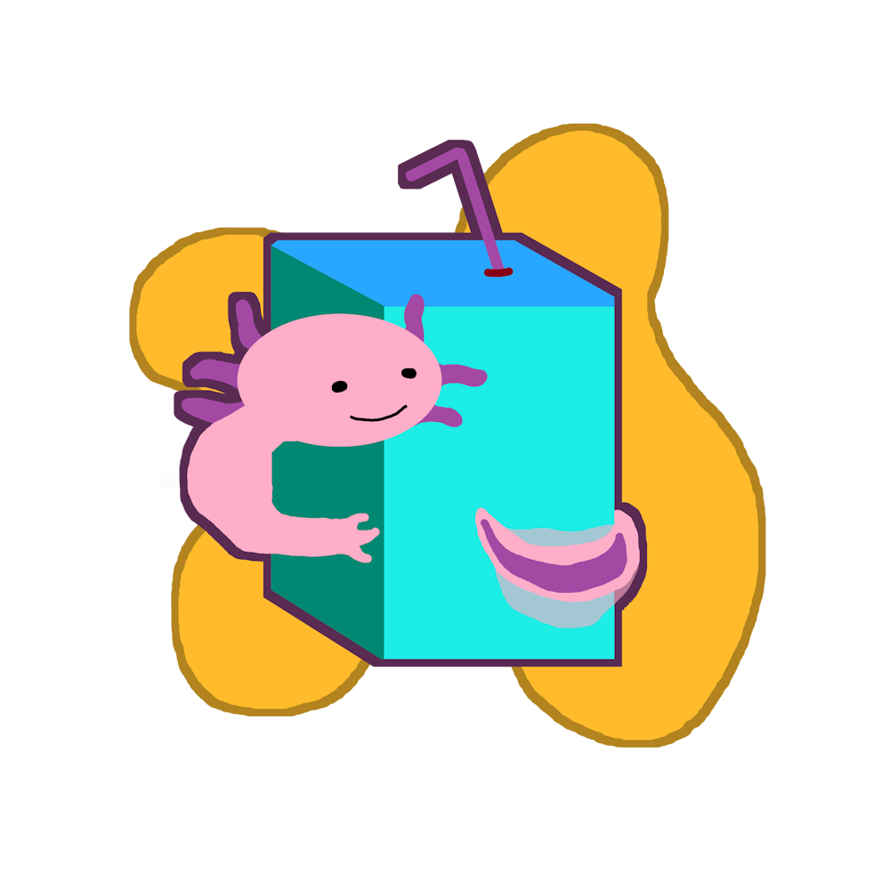

# JuiceBox - Spilling Encouraged!
JuiceBox is a 2D PIC/FLIP fluid simulator built in Rust using the Bevy game engine.

| Engineer			| Role			|
| :-----------		| :-----------	|
| Dillon Goicoechea	| Scrummaster	|
| Garrett Crites	| Build Meister	|
| Kade Samson		| Scribe		|
| Matthew Fisk		| Tech Lead		|

